# Data Pipeline Documentation

This document describes the complete data collection and preprocessing pipeline for AutoDoc.

## Pipeline Overview

```mermaid
flowchart LR
    subgraph Sources["Data Sources"]
        CSN[CodeSearchNet]
        TV[The Vault]
        GH[GitHub API]
    end

    subgraph Raw["Raw Storage"]
        RP[data/raw/]
    end

    subgraph Preprocess["Preprocessing"]
        CL[Clean]
        FI[Filter]
        FO[Format]
    end

    subgraph Processed["Processed Data"]
        PD[data/processed/*.jsonl]
    end

    subgraph Split["Train/Val/Test"]
        TR[80% Train]
        VA[10% Val]
        TE[10% Test]
    end

    subgraph Training["Fine-Tuning"]
        QW[Qwen2.5-Coder + LoRA]
    end

    Sources --> Raw --> Preprocess --> Processed --> Split --> Training
```



---

## Stage 1: Data Collection

### 1.1 Download Pre-Built Datasets

**Script:** `scripts/download_datasets.py`

```bash
python scripts/download_datasets.py --datasets codesearchnet,thevault
```

**Process:**
1. Download from HuggingFace Hub
2. Convert to unified parquet format
3. Store in `data/raw/{dataset_name}/`

### 1.2 GitHub Scraping

**Script:** `scripts/scrape_github.py`

```bash
python scripts/scrape_github.py --stars 500 --limit 1000
```

**Process:**
1. Query GitHub API for qualifying repos
2. Clone/download README.md + structure
3. Extract relevant source files
4. Store in `data/raw/github/`

**Rate Limiting:**
- With token: 5000 requests/hour
- Without token: 60 requests/hour
- Built-in exponential backoff

---

## Stage 2: Preprocessing

**Script:** `scripts/preprocess.py`

```bash
python scripts/preprocess.py --input data/raw --output data/processed
```

### 2.1 Cleaning Steps

| Step | Description |
|------|-------------|
| **Deduplication** | Remove exact and near-duplicate entries |
| **Language Filter** | Keep English-only content |
| **Length Filter** | Remove too short/long entries |
| **Quality Filter** | Remove templated/auto-generated docs |

### 2.2 Quality Heuristics

We filter out entries with:
- Generic phrases: "TODO", "FIXME", "Add description"
- Template markers: `{{`, `}}`, `%s`
- Excessive boilerplate ratio (> 50%)
- Non-ASCII ratio > 20%

### 2.3 Format Conversion

Convert source format → Alpaca instruction format:

```python
# CodeSearchNet format
{
    "func_code_string": "def foo(): ...",
    "func_documentation_string": "Does foo things"
}

# Converted to
{
    "instruction": "Generate documentation for this function",
    "input": "```python\ndef foo(): ...\n```",
    "output": "Does foo things"
}
```

---

## Stage 3: Dataset Splitting

**Split ratios:** 80% train / 10% validation / 10% test

**Stratification:** Balanced by:
- Programming language
- Documentation length
- Task type (function doc, README, etc.)

**Output files:**
```
data/processed/
├── train.jsonl      # Training set
├── val.jsonl        # Validation set
├── test.jsonl       # Test set
└── metadata.json    # Dataset statistics
```

---

## Configuration

All pipeline settings are in `config/pipeline.yaml`:

```yaml
download:
  datasets:
    - name: codesearchnet
      languages: [python, javascript]
    - name: thevault
      subset: function
      
scraping:
  github:
    min_stars: 500
    max_repos: 1000
    languages: [python, javascript, typescript]
    
preprocessing:
  min_input_tokens: 50
  max_input_tokens: 4000
  min_output_tokens: 20
  max_output_tokens: 2000
  
splitting:
  train_ratio: 0.8
  val_ratio: 0.1
  test_ratio: 0.1
  seed: 42
```

---

## Running the Full Pipeline

```bash
# 1. Install dependencies
pip install -r requirements.txt

# 2. Download datasets
python scripts/download_datasets.py

# 3. Scrape GitHub (optional, requires token)
export GITHUB_TOKEN=your_token_here
python scripts/scrape_github.py

# 4. Preprocess all data
python scripts/preprocess.py

# 5. Verify output
python scripts/validate_dataset.py
```

---

## Output Verification

After running the pipeline, verify with:

```bash
# Check dataset statistics
python scripts/validate_dataset.py --stats

# Sample random entries for manual review
python scripts/validate_dataset.py --sample 10

# Run format validation tests
pytest tests/test_data_format.py
```
